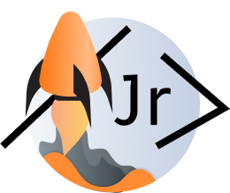

<!-- PROJECT LOGO -->
 

  
   

Cohorte 5 Grupo 28

  <h3 align="center">Junior Coder Book</h3>

  

    Comparti tus notas, con otros desarrolladores y estudiantes.
     
	·
    <a href="https://juniorcoderbook2.herokuapp.com"><strong>View Demo »</strong></a>
	·
     
     
	·
<a href="https://www.figma.com/file/qvjt4jUdZWeUnP29VwZfXW/Inicio?node-id=0%3A1"><strong>Figma</strong></a>
    ·
  

  

  
Tecnologias utilizadas

  

    <li>
      <a href="#about-the-project"><strong>UX/UI - Maquetado</strong></a>
    </li>
   <li>
      <a href="#about-the-project">Figma</a>
    </li>
    <li>
      <a href="#about-the-project">Boostrap</a>
    </li>
     <li>
      <a href="#about-the-project">Responsive</a>
    </li>
    <li>
      <a href="#about-the-project"><strong>FRONTEND</strong></a>
    </li>
     <li>
      <a href="#about-the-project">React</a>
    </li>
     <li>
      <a href="#about-the-project">Axios</a>
    </li>
     <li>
      <a href="#about-the-project">Context / Local storage</a>
    </li>
     <li>
      <a href="#about-the-project">React router V6</a>
    </li>
    <li>
      <a href="#about-the-project">Reducer</a>
    </li>
    <li>
      <a href="#about-the-project"><strong>BACKEND</strong></a>
    </li>
     <li>
      <a href="#about-the-project">Express</a>
    </li>
     <li>
      <a href="#about-the-project">Bcrypt</a>
    </li>
     <li>
      <a href="#about-the-project">Validator</a>
    </li>
     <li>
      <a href="#about-the-project">JsonWebToken</a>
    </li>

  

  
Colaboradores

  

    <li><a href="#about-the-project">Oriana del valle de Caro - Product Manager/Backend </a></li>
    <li><a href="#getting-started">Cristian Gomez - Fullstack Developer</a></li>
    <li><a href="#usage">Gonzalo Altamirano - FullStack Developer</a></li>
    <li><a href="#license">Karina Monetti - Frontend/ Diseño UI</a></li>
    <li><a href="#roadmap">Ignacio Guridi - Frontend </a></li>
    <li><a href="#contributing">Raphael Richardson - Frontend</a></li>
  

  
Fotos

  <ol>
    <li></li>
    <li></li>
  </ol>

  
About

Proyecto de red social/blog  para desarrolladores junior donde pueden compartir ideas, proyectos, codigos, aprender nuevos lenguajes de programacion, seguir otros desarrolladores.

